# Sigfox Platform

**Warning: Project under active development, do not use it for production!**

## About this project

This project is a cloud platform to manage and visualize Sigfox devices and messages.

## Get started

### [Demo](https://sigfox-platform.thenorthweb.com)

### Try it now with [Heroku](https://heroku.com)

Deploy an instance on your Heroku account to play around with it!

Warning: When using the free plan, the application goes to sleep after 30 min of inactivity (checkout the [pricing](https://www.heroku.com/pricing)).

[](https://heroku.com/deploy)

An alternative way to get it running at Heroku is to install the [Heroku Toolbelt](https://toolbelt.heroku.com) and follow these steps:

```
git clone https://github.com/IoT-Makers/sigfox-platform.git my-project
cd my-project
heroku apps:create my-project
git push heroku master
```

If you are not familiar with Heroku, just create an account an follow the procedure:

1. **Create a new app:**


2. **Build & deploy app:**

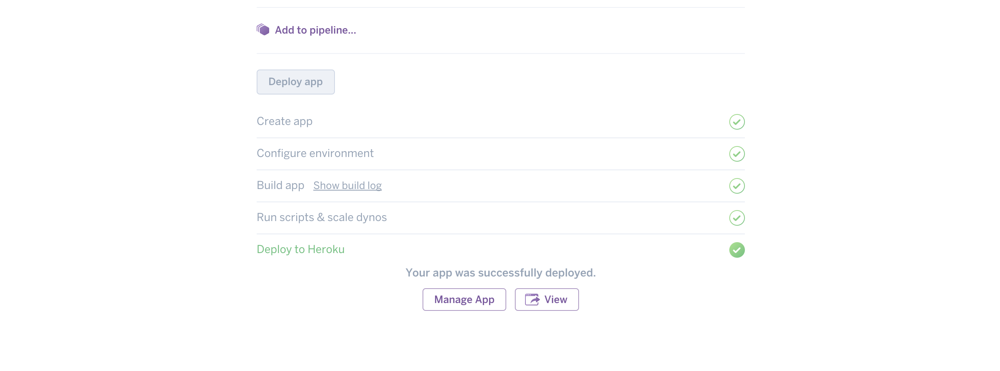

3. **(Optional) Link the application with a MongoDB MLab database (Free):**

*Note that if you don't link a database to your application, all the data will be erased every time the application restarts.*

* Go to [https://mlab.com](https://mlab.com/login/) and create an account and login.

* Create a new MongoDB Deployments:


* Select your plan:


* Select your region:

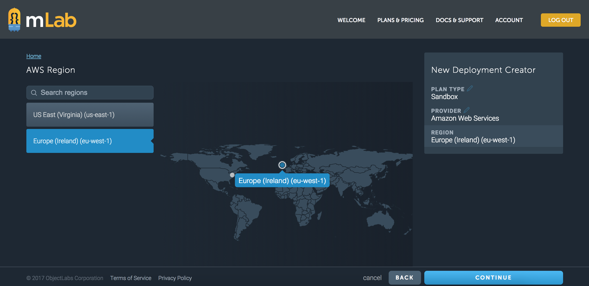

* Create database:

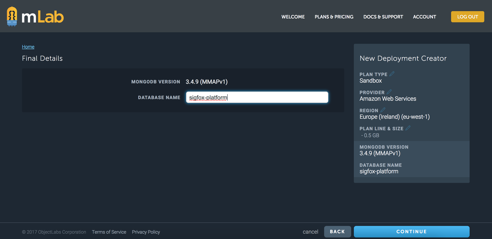

* Validate:

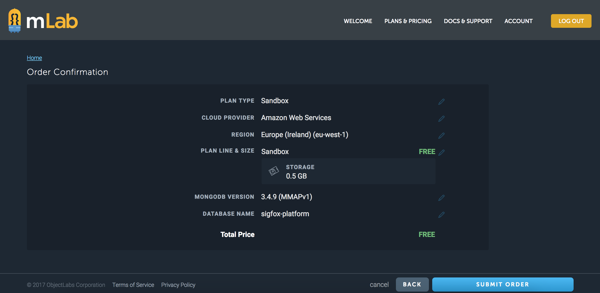

* Create database user:


* Copy your MongoDB URI :

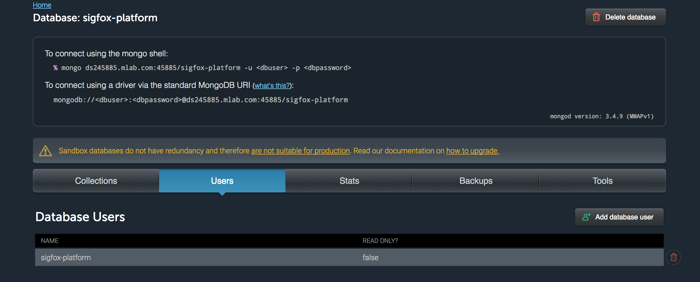

* Go back to your Heroku Dashboard and go to the Settings tab:

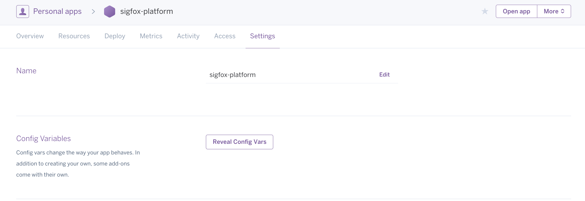

* Click on Reveal Config Vars and add your MongoDB URI:

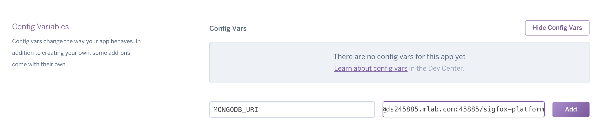

**You may also add the variable SECRET with a password of your choice. This SECRET will be used to cypher all the connector passwords you add in the application.**

* Restart all dynos:

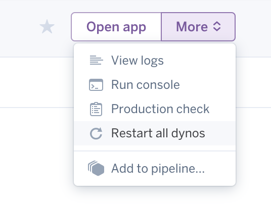


### User guide

- Open app and register:

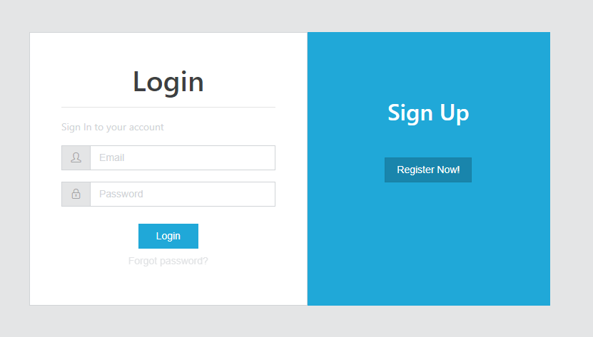

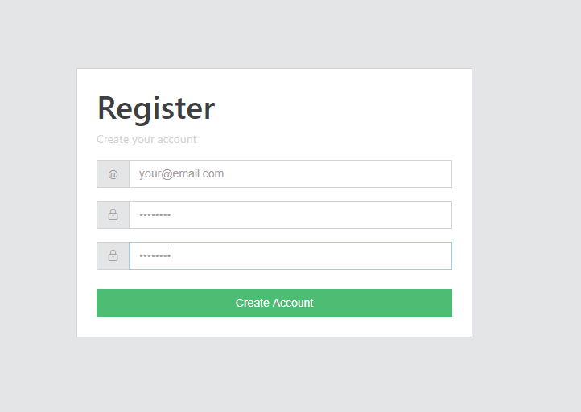

Note that, the first user to register will be granted an admin role.
The other users to register will be granted user roles.


## Development

This project uses Loopback 3, Angular 4, Fireloop and MongoDB.

### Requirements

### API (To Be Updated, below is an old version)

Below is the functional/sequential diagram representing the message journey.

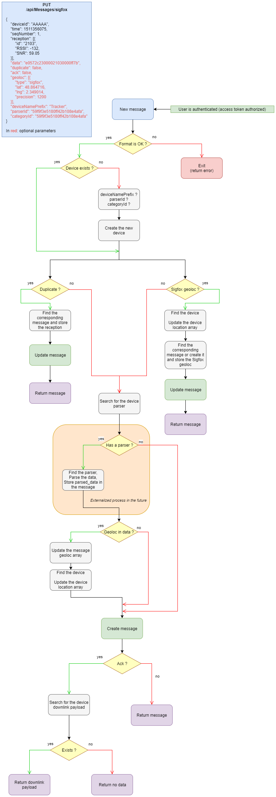

### Webapp

#### Color code

| GPS | Sigfox | WiFi | BLE |
| :-------: | :-------: | :-------:	| :-------: |
|  `#9B7A48` |  `#792FAA` |  `#2F2A30` |  `#3C58CE` |

#### Developers

##### Linking a Sigfox device to the platform

Once the application is deployed, head over to the 'connectors'. You will need to create a developer access token in order to secure the API calls. You can then copy & paste the callback information you need in the device type new callback onto the [Sigfox Backend](https://backend.sigfox.com/).

##### Adding a custom parser

A short wiki can be found [here](https://github.com/IoT-Makers/sigfox-platform/wiki/Adding-a-custom-parser).

## Roadmap


## Authors

* [Antoine de Chassey](https://github.com/AntoinedeChassey)
* [Louis Moreau](https://github.com/luisomoreau)

## Contributors

Feel free to submit a Pull Request and don't forget to add you name and your useful links ;)

> Made with &nbsp;:heart:&nbsp; by Antoine de Chassey & Louis Moreau
