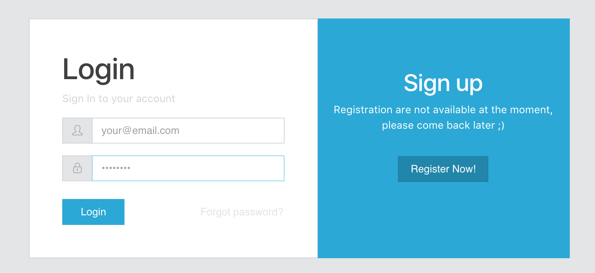

# Sigfox Platform


## About this project

This project is a cloud platform to manage and visualize Sigfox devices and messages.

## Get started

### Demo

### Try it now with Heroku

Deploy an instance on your Heroku account to play around with it!

[](https://heroku.com/deploy)

An alternative way to get it running at Heroku is to install the [Heroku Toolbelt](https://toolbelt.heroku.com) and follow these steps:

```
git clone https://github.com/luisomoreau/sigfox-platform.git my-project
cd my-project
heroku apps:create my-project
git push heroku master
```

If you are not familiar with Heroku, just create an account an follow the procedure:

- Create a new app:


- Build & deploy app:


### User guide

- Open app and register:




Note that, the first user to register will be granted an admin role.
The other users to register will be granted user roles.


## Development

This project uses Loopback 3, Angular 4, Fireloop and MongoDB.

### Requirements

### API

### Webapp

## Contributors

* [Antoine de Chassey](https://github.com/AntoinedeChassey)
* [Louis Moreau](https://github.com/luisomoreau)
