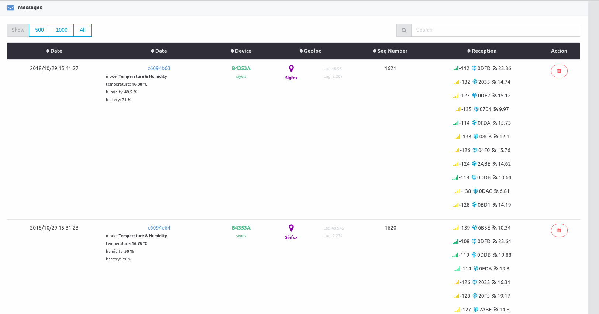

# Sigfox Platform

**Disclaimer: Project under active development, use it at your own risk!**

## About this project
This is a cloud platform to manage Sigfox devices and visualize messages.

## [Try it](https://try.iotagency.sigfox.com)
You can deploy it yourself, but we encourage you to try it out [here](https://try.iotagency.sigfox.com).

## Features  

**Create customizable dashboards**

*charts*

*maps*

**Review raw & decoded data in realtime**

**Create and share parsers**

**Connect to other services with alerts**

**Manage devices, share with others in organization**

## Technologies

### Application
 * Backend: [Loopback 3+](https://loopback.io/)
 * Frontend: [Angular 6+](https://angular.io/)
 * Real-time: [Primus](https://github.com/primus/primus)
 * Database: [MongoDB](https://www.mongodb.com/en)
 * Pub-sub & queuing: [RabbitMQ](https://www.rabbitmq.com/)
 
 ### Deployment
 * Reverse proxy: [Traefik](https://traefik.io/) => a nice talk @devoxx to understand Traefik [here](https://www.youtube.com/watch?v=AqiGcLsVMeI)
 * Containerization: [Docker](https://www.docker.com/)
 * Orchestrator: [Docker Swarm](https://docs.docker.com/engine/swarm/)
 * Environment management UI: [Portainer](https://portainer.io/)
 * DB backups (private cloud storage): [Minio](https://www.minio.io/)

 ### Monitoring
* Metrics database: [Prometheus](https://prometheus.io/)
* Visualize metrics: [Grafana](https://grafana.com/)
* Host metrics collector: [Node-exporter](https://github.com/prometheus/node_exporter)
* Containers metrics collector: [cAdvisor](https://github.com/google/cadvisor/)
* Docker daemon metrics collector: [dockerd-exporter](https://github.com/stefanprodan/dockerd-exporter)
* Alerts dispatcher: [Alertmanager](https://github.com/prometheus/alertmanager)
* Alert manager dashboard: [Unsee](https://github.com/google/cadvisor/)
 
## Development

### Requirements

### API (To Be Updated, below is an old version)

Below is the functional/sequential diagram representing the message journey.

### Frontend

#### Color code

| GPS | Sigfox | WiFi | BLE |
| :-------: | :-------: | :-------:	| :-------: |
|  `#9B7A48` |  `#792FAA` |  `#2F2A30` |  `#3C58CE` |

## Gurus

### Linking a Sigfox device to the platform

Once the application is deployed, head over to the 'connectors'. You will need to create a developer access token in order to secure the API calls. You can then copy & paste the callback information you need in the device type new callback onto the [Sigfox Backend](https://backend.sigfox.com/).

### Adding a custom parser

A short wiki can be found [here](https://github.com/IoT-Makers/sigfox-platform/wiki/Adding-a-custom-parser).

## Roadmap

## Author & co-author

<table><tr><td align="center"><a href="https://twitter.com/adechassey"> <b>Antoine de Chassey</b></a> <a href="https://github.com/IoT-Makers/sigfox-platform/commits?author=AntoinedeChassey" title="Code">💻</a></td><td align="center"><a href="http://louismoreau.eu"> <b>Louis MOREAU</b></a> <a href="https://github.com/IoT-Makers/sigfox-platform/commits?author=luisomoreau" title="Code">💻</a></td></tr></table>

## Contributors

<!-- ALL-CONTRIBUTORS-LIST:START - Do not remove or modify this section -->
<!-- prettier-ignore-start -->
<!-- markdownlint-disable -->
<table>
  <tr>
    <td align="center"><a href="https://github.com/siyu6974"> <b>Siyu</b></a> <a href="https://github.com/IoT-Makers/sigfox-platform/commits?author=siyu6974" title="Code">💻</a></td>
    <td align="center"><a href="https://twitter.com/aureleq"> <b>Aurelien Lequertier</b></a> <a href="https://github.com/IoT-Makers/sigfox-platform/commits?author=aureleq" title="Code">💻</a></td>
    <td align="center"><a href="https://github.com/markoceri"> <b>Marko</b></a> <a href="https://github.com/IoT-Makers/sigfox-platform/commits?author=markoceri" title="Code">💻</a></td>
    <td align="center"><a href="https://twitter.com/nestorayuso"> <b>Nestor Ayuso</b></a> <a href="https://github.com/IoT-Makers/sigfox-platform/commits?author=nestorayuso" title="Documentation">📖</a></td>
    <td align="center"><a href="http://www.splendido.fr"> <b>Florian Splendido</b></a> <a href="#platform-splendf" title="Packaging/porting to new platform">📦</a></td>
    <td align="center"><a href="https://github.com/honeytrap15"> <b>takegami</b></a> <a href="https://github.com/IoT-Makers/sigfox-platform/commits?author=honeytrap15" title="Code">💻</a></td>
    <td align="center"><a href="https://www.inn-farm.co.jp/"> <b>Innovation Farm, Inc.</b></a> <a href="https://github.com/IoT-Makers/sigfox-platform/commits?author=Innovation-Farm" title="Code">💻</a></td>
  </tr>
</table>

<!-- markdownlint-restore -->
<!-- prettier-ignore-end -->

<!-- ALL-CONTRIBUTORS-LIST:END -->

Feel free to submit a Pull Request and don't forget to add you name and your useful links.

## Support this project
Hey dude! Help me out for a couple of :beers: or :coffee:!

